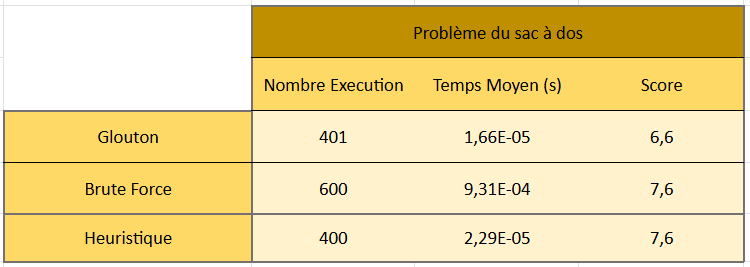
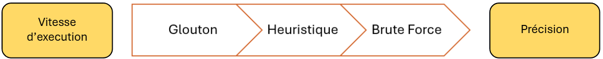

# 🎒 Projet d'Optimisation : Problème du Sac à Dos

## 📖 Description

Ce projet propose une implémentation en Python permettant de résoudre le célèbre **Problème du Sac à Dos (Knapsack Problem)**. L'objectif est de sélectionner une liste d'objets (par exemple des équipements pour le vélo) afin de **maximiser l'utilité totale** tout en respectant une **contrainte de poids maximal**.

Le projet compare plusieurs approches algorithmiques et intègre un système de profilage permettant de mesurer et d'analyser leurs performances.

---

## 📂 Structure du Projet

```text
.
├── mainsSac.py
├── module/
│   ├── Objets.py
│   ├── Sac_a_dos.py
│   └── Objet.py
├── fonction/
│   ├── Brute_Force.py
│   ├── calcule_moyenne.py
│   ├── Brute_Force.py
│   ├── Glouton.py
│   ├── heuristique.py
│   └── decorator.py
├── data/
│   └── velo.xlsx
└── stats_temps/
```

### Description des fichiers

| Fichier                       | Description                                                                               |
|-------------------------------|-------------------------------------------------------------------------------------------|
| `mainsSac.py`                 | Script principal permettant de lancer les tests et benchmarks.                            |
| `fonction/calcule_moyenne.py` | Calcule les temps moyens d'exécution à partir des logs générés. Contient son propre main. |
| `module/Objet.py`             | Définition d'un objet avec son nom, sa masse et son utilité.                              |
| `module/Objets.py`            | Chargement des objets depuis le fichier Excel `data/velo.xlsx`.                           |
| `module/Sac_a_dos.py`         | Gestion du sac à dos, de sa capacité restante et de son utilité totale.                   |
| `fonction/Brute_Force.py`     | Algorithme exact par force brute.                                                         |
| `fonction/Glouton.py`         | Algorithme glouton basé sur le ratio utilité/masse.                                       |
| `fonction/heuristique.py`     | Variante heuristique avec filtrage des objets.                                            |
| `fonction/decorator.py`       | Décorateur de chronométrage des algorithmes.                                              |
| `data/`                       | Contient les jeux de données d'entrée.                                                    |
| `stats_temps/`                | Dossier généré automatiquement contenant les statistiques de temps d'exécution.           |

---

## 🧠 Algorithmes Implémentés

### 1. Brute Force

**Fichier :** `Brute_Force.py`

Explore toutes les combinaisons possibles via un arbre de décision récursif.

**Avantages :**

* Garantit la solution optimale.

**Inconvénients :**

* Complexité exponentielle.
* Temps d'exécution très élevé lorsque le nombre d'objets augmente.

---

### 2. Glouton Optimisé

**Fichier :** `Glouton.py`

Trie les objets selon leur ratio :

```text
utilité / masse
```

Les objets sont ensuite ajoutés au sac dans cet ordre jusqu'à atteindre la capacité maximale.

**Avantages :**

* Très rapide.
* Facile à implémenter.
* Complexité semi Logarithmique (tri)
* 
**Inconvénients :**

* Ne garantit pas la solution optimale.

---

### 3. Heuristique

**Fichier :** `heuristique.py`

Version améliorée de l'approche gloutonne avec une condition supplémentaire :

```text
utilité > 1.0
```

Seuls les objets respectant ce critère sont considérés.

**Avantages :**

* Réduction du nombre d'objets évalués.
* Exécution rapide.
* Complexité semi logarithmique

**Inconvénients :**

* Peut écarter des solutions intéressantes.
* Solution non garantie optimale.

---

## ⚙️ Prérequis

* Python 3.x
* pandas
* openpyxl
* matplotlyb

### Installation des dépendances

```bash
pip install pandas openpyxl matplotlib
```

---

## 🚀 Utilisation

### 1. Préparer les données

Placer le fichier Excel contenant les objets dans :

```text
data/velo.xlsx
```

---

### 2. Exécuter les algorithmes

Lancer le script principal :

```bash
python mainsSac.py
```

Par défaut, le fichier exécute un benchmark via la fonction :

```python
calculetemps()
```

Vous pouvez également tester individuellement les algorithmes en décommentant les fonctions suivantes dans :

```python
if __name__ == "__main__":
```

```python
testbrute_force()
testGlouton_optimise()
testheuristique()
```

Ces fonctions affichent le contenu du sac ainsi que les résultats obtenus.

---

## 📊 Analyse des Performances

Chaque exécution d'un algorithme est automatiquement chronométrée grâce au décorateur :

```python
@chronometrer
```

Les résultats sont enregistrés dans le dossier :

```text
stats_temps/
```

Pour calculer les temps moyens d'exécution :

```bash
python calcule_moyenne.py
```

---

## 🏗️ Conception

Le projet utilise un **Design Pattern Décorateur** afin de séparer la logique métier du système de mesure des performances.

Exemple :

```python
@chronometrer
def algorithme():
    pass
```

Cette approche permet d'ajouter le chronométrage sans modifier le code des algorithmes.

---

## 👥 Auteurs

### Mathis

* Algorithme Brute Force
* Scripts de statistiques
* Modèles d'objets

### Thierry

* Algorithme Glouton
* Algorithme Heuristique
* Modèle du Sac à Dos

---

## 📜 Résultat



## ✅ Conclusion

