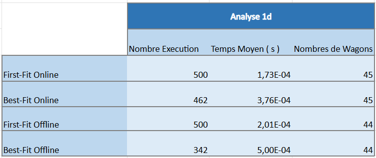
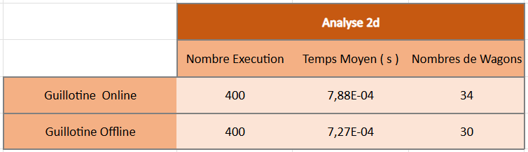
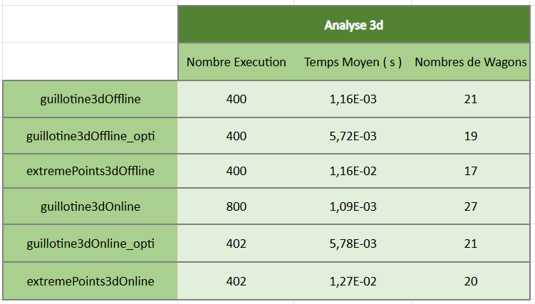

# 🚂 Optimisation de Chargement de Wagons (Bin Packing)

## 📖 Présentation

Ce projet est une suite algorithmique développée en Python visant à résoudre le problème du **Bin Packing** appliqué au fret ferroviaire.

L'objectif est de répartir un ensemble de marchandises de tailles variées dans le **minimum de wagons possible**, tout en optimisant l'utilisation de l'espace disponible.

Le projet explore plusieurs dimensions du problème :

* 📏 **1D** : optimisation sur la longueur.
* 📐 **2D** : optimisation sur la surface.
* 📦 **3D** : optimisation sur le volume et les contraintes physiques.

Il compare également deux approches classiques :

* **Offline** : toutes les marchandises sont connues et triées avant le chargement.
* **Online** : les marchandises arrivent progressivement et doivent être placées immédiatement.

---

# 📂 Arborescence du Projet

```text
projet_bin_packing/
├── mainWagon.py
├── data/
│   └── marchandises.xlsx
├── module/
│   ├── conteneur.py
│   ├── marchandise.py
│   ├── marchandises.py
│   └── train.py
└── fonction/
    ├── fristfit1d.py
    ├── bestfit1d.py
    ├── Offline2d.py
    ├── Online2d.py
    ├── Guillotine3d.py
    ├── extermePoint3d.py
    ├── extermePoint3d_challing_temp.py
    ├── decorator.py
    └── calcule_moyenne.py
```

---

# 🏗️ Architecture Orientée Objet

Le projet repose sur une modélisation réaliste du transport ferroviaire.

## `marchandise.py`

Définit une marchandise avec :

* Dimensions (longueur, largeur, hauteur)
* Volume
* Surface
* Coordonnées de placement (X, Y, Z)

---

## `marchandises.py`

Parseur de données chargé de :

* Lire le fichier Excel `marchandises.xlsx`
* Créer automatiquement les instances de `Marchandise`

---

## `conteneur.py`

Représente un wagon individuel.

### Dimensions du conteneur

| Longueur | Largeur | Hauteur |
| -------- | ------- | ------- |
| 11.583 m | 2.294 m | 2.569 m |

Fonctionnalités :

* Ajout de marchandises
* Calcul du volume utilisé
* Calcul du volume restant

---

## `train.py`

Représente un convoi complet composé d'une liste de conteneurs.

Fonctionnalités :

* Gestion globale du chargement
* Affichage synthétique du train
* Visualisation 3D du remplissage via Matplotlib

---

# 📊 Algorithmes de Placement

## Prétraitement Offline

Les versions Offline utilisent un tri hybride intelligent en fonction de l'algorithme:

 - Tri par dimension maximale décroissante. 
 - Tri par volume décroissant.

Cette stratégie réduit fortement la fragmentation de l'espace disponible.

---

# 📏 Algorithmes 1D

## First Fit

**Fichier :** `fristfit1d.py`

Place chaque marchandise dans le premier wagon disposant d'un espace suffisant.

### Complexité

| Cas      | Complexité |
| -------- | ---------- |
| Pire cas | O(N²)      |

### Avantages

* Rapide
* Très simple à implémenter

### Inconvénients

* Utilisation de l'espace parfois inefficace

---

## Best Fit

**Fichier :** `bestfit1d.py`

Parcourt tous les wagons existants afin de sélectionner celui laissant le moins d'espace libre après insertion.

### Complexité

| Cas      | Complexité |
| -------- | ---------- |
| Pire cas | O(N²)      |

### Avantages

* Meilleur remplissage que First Fit

### Inconvénients

* Plus coûteux à calculer

---

# 📐 Algorithmes 2D

## Guillotine 2D

**Fichiers :**

* `Offline2d.py`
* `Online2d.py`

L'espace libre est représenté sous forme de rectangles.

Après chaque insertion, les espaces restants sont découpés selon le principe de la guillotine.

### Complexité

| Cas      | Complexité |
| -------- | ---------- |
| Pire cas | O(N³)      |

### Caractéristiques

* Gestion efficace des surfaces libres
* Compatible avec les approches Online et Offline

---

# 📦 Algorithmes 3D

## Extreme Points 3D

**Fichier :** `extermePoint3d.py`

Cette méthode ne suit pas les volumes libres.

À la place, elle génère des **points extrêmes** situés aux coins des marchandises déjà placées.

L'algorithme applique une heuristique :

**Deepest Bottom-Left**

Les marchandises sont placées :

1. Le plus bas possible
2. Le plus au fond possible
3. Le plus à gauche possible

## Extreme Points 3D adapté au challenge temps

**Fichier :** `extermePoint3d-challenge_temps.py`

Cette fonction reprend les bases de **extreme point**. Mais diminue la complexité moyenne pour grandement diminuer le temps d'execution


Modification principal :

1. On enlève le tri des orientations 
2. On diminue le nombre d'orientation les conteneurs et marchandises étant dans le sens des longueurs

D'autre modification essayer mais non fructueuse donc retiré aprés test
1. Le Filtre Volumétrique : Si le volume restant que contenaire est inférieur à celui de la marchandise, les extremes points de ce contener ne sont pas tester
2. Le "Fast Pop" : Plutot qu'enlever un extreme point au millieu du tableau et décaller le reste, on le remplace par la dernière valeur et on enlève la dernière valeur
3. Remplacement des objets Extreme Point en tuple


### Complexité

| Cas      | Complexité |
| -------- | ---------- |
| Pire cas | O(N³)      |

### Avantages

* Très utilisée en optimisation 3D
* Excellente densité de remplissage

---

## Guillotine 3D

**Fichier :** `Guillotine3d.py`

Extension directe de la méthode Guillotine 2D.

Les espaces libres sont représentés sous forme de parallélépipèdes puis découpés selon différents axes :

* X
* Y
* Z

### Complexité

| Cas      | Complexité |
| -------- | ---------- |
| Pire cas | O(N³)      |

---

# 🗄️ Base de Données

Les marchandises sont chargées depuis :

```text
data/marchandises.xlsx
```

## Nouveauté : Gestion des objets retournables

Une colonne supplémentaire a été ajoutée :

```text
Retournable
```

Valeurs possibles :

| Valeur | Signification         |
| ------ | --------------------- |
| 0      | Objet non retournable |
| 1      | Objet retournable     |

Cette contrainte permet d'interdire certaines rotations pour les objets sensibles :

* Fûts chimiques
* Palettes de verre
* Moteurs industriels
* Équipements fragiles

Les algorithmes 3D respectent automatiquement cette contrainte tout en autorisant les rotations horizontales lorsque cela est possible.

Cette amélioration renforce considérablement le réalisme de la simulation logistique.

---

# 🛠️ Outils de Benchmarking

## Décorateur de Chronométrage

**Fichier :** `decorator.py`

Le projet utilise un Design Pattern Décorateur :

```python
@chronometrer
def algorithme():
    pass
```

Fonctionnalités :

* Mesure du temps réel avec `time.perf_counter()`
* Sauvegarde automatique des résultats
* Génération de fichiers de statistiques

Les résultats sont enregistrés dans :

```text
stats_temps/
```

---

## Analyse des Temps

**Fichier :** `calcule_moyenne.py`

Permet de :

* Lire les fichiers de logs
* Calculer les moyennes d'exécution
* Comparer les performances des algorithmes

---

# ⚙️ Installation

## Dépendances

```bash
pip install pandas openpyxl matplotlib
```

---

# 🚀 Exécution

## Lancer le programme principal

```bash
python mainWagon.py
```

---

## Calculer les performances moyennes

Une fois les logs générés :

```bash
python fonction/calcule_moyenne.py
```

# 👥 Auteurs

### Thierry Gnimtou Assimtoke


### Mathis Letellier


---

# 📜 Résultat
## 📏 Algorithmes 1D


## 📐 Algorithmes 2D


## 📦 Algorithmes 3D
